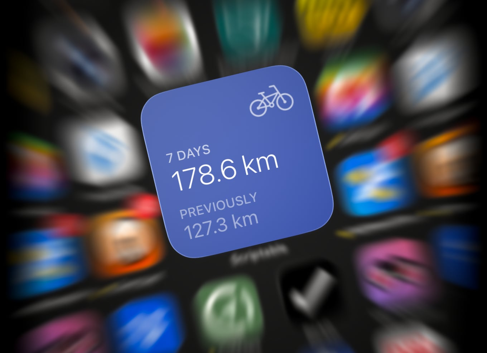

# small-seasons

*Scriptable widget that displays some cycling distance stats.*

**Explain!**
Once set up (see "Any setup required?" below), the widget will show your total cycling distance in the last seven days, plus the previous seven days. Keeps me motivated to try and Make Number Go Up.

Serving suggestion, app icon warp effect not included.

**Any setup required?**
Yes! Because Scriptable can't access Health data directly, your cycling stats need to be exported regularly via Shortcuts. Import `weekly-cycling-distance.shortcut` into Shortcuts, run it once to grant read-only Health permissions, then set up one or multiple automations as shown in `automatation-setup.png`. Then, the usual: Download `weekly-cycling-distance.js` and place it in the "Scriptable" directory in your iCloud Drive. Then, back on your homescreen, [go into jiggle mode](https://www.youtube.com/watch?v=pAOjDXdiUzM) and create a new Scriptable widget of your preferred size. Tap it to assign the relevant script to it, then wait a second for it to draw itself for the first time.
